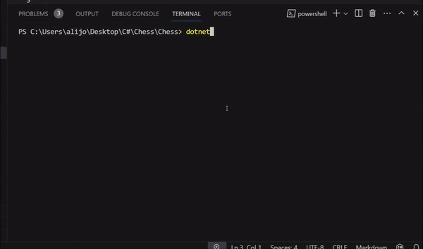

# Chess
## Chess pieces
Bu dastur sizga shaxmat o'yinini o'rganishingizda yordam beradi.   
Siz shaxmatdagi figuralardan birini tanlaysiz va uning koordinatasini kiritasiz.   
Shundan so'ng siz qaysi kataklarga yura olishingiz '1' va yura olmaydigan katakchalaringiz esa '0' bilan belgilanadi.   
Siz turgan katakcha esa 'F' harfi bilan belgilanadi.   

